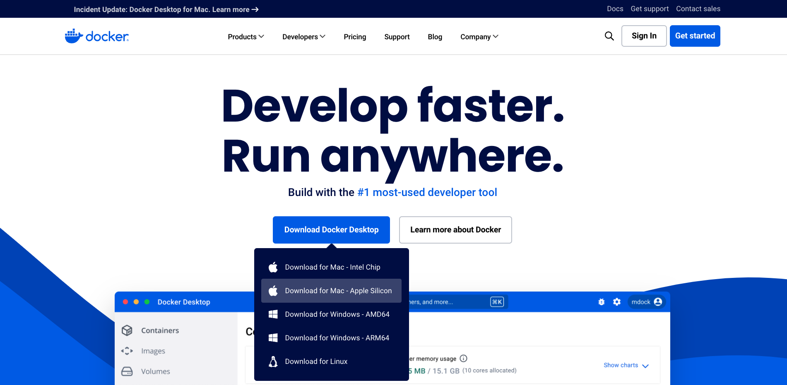
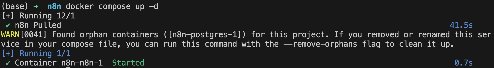
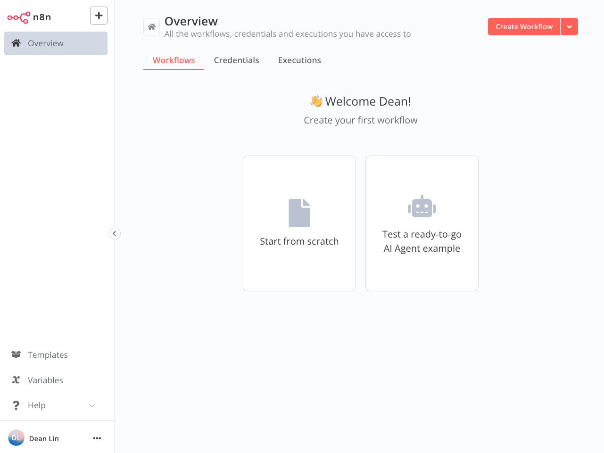

# [n8n 教學]在本地建立能串連不同服務的自動化工具

n8n 是款能把你從重複的例行性任務中，拯救出來的自動化工具。

使用者可以透過視覺化的介面，用拖拉節點、設定參數的方式來建立符合自己需求的工作流。

他有雲端與本地（local）的版本，考量到許多工作流程需要放上私鑰（ex: Google API Key、OpenAI API Key），以及雲端版本至少要付費 20 歐元（限制工作流程執行 2500 次）；所以筆者選擇了本地部署的方案，並在這篇文章分享詳細的操作步驟。

## ▋ STEP 1: 安裝 Docker

前往 Docker 官網: https://www.docker.com/

根據自己的作業系統選擇對應的版本下載。



## ▋ STEP 2: 使用 docker-compose.yml 安裝 n8n

你可以直接 git clone 筆者的 GitHub 專案，或者建立一個 `n8n` 的資料夾，新增 `docker-compose.yml` 檔案。

```yml
volumes:
  n8n_storage:

services:
  n8n:
    image: n8nio/n8n:latest
    restart: always
    ports:
      - "127.0.0.1:5678:5678" # 根據實際需求設定
    volumes:
      - n8n_storage:/home/node/.n8n
```

貼上內容後，在終端機（Terminal）輸入 `docker compose up -d` 即可啟動



## ▋ STEP 3: 註冊 n8n 帳號

進入網址: http://127.0.0.1:5678 

如果看到下面的帳號設定畫面就代表你 n8n 安裝成功了！


帳號設定完成後，你會看到下面的初始畫面。



這邊要特別提醒的是，`你一定要記得自己的 Email 跟 Password`，因為官方 Forgot Password 的功能只是擺飾用的。


為了避免資訊量過載，n8n Node（節點）的使用方法將會在下一篇文章向讀者分享。

> 延伸閱讀:
> - [[n8n 教學]掌握節點 (Node) 使用情境：Set、Loop Over items、If、Code、HTTP Request、Wait]()
> - [[n8n 教學]在 Google Sheet 自動建立 SEO 關鍵字矩陣]()