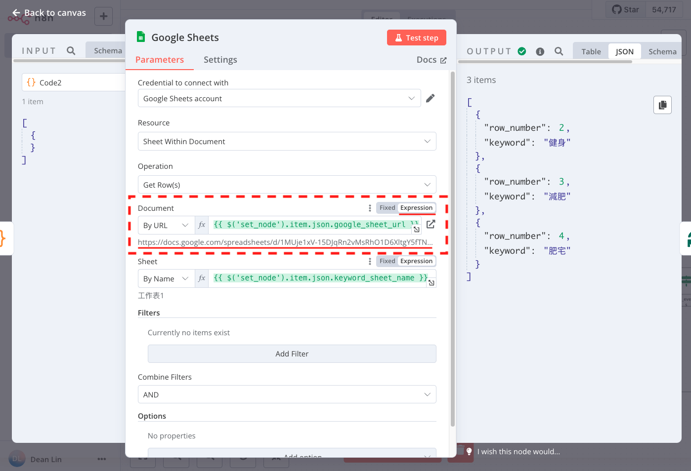
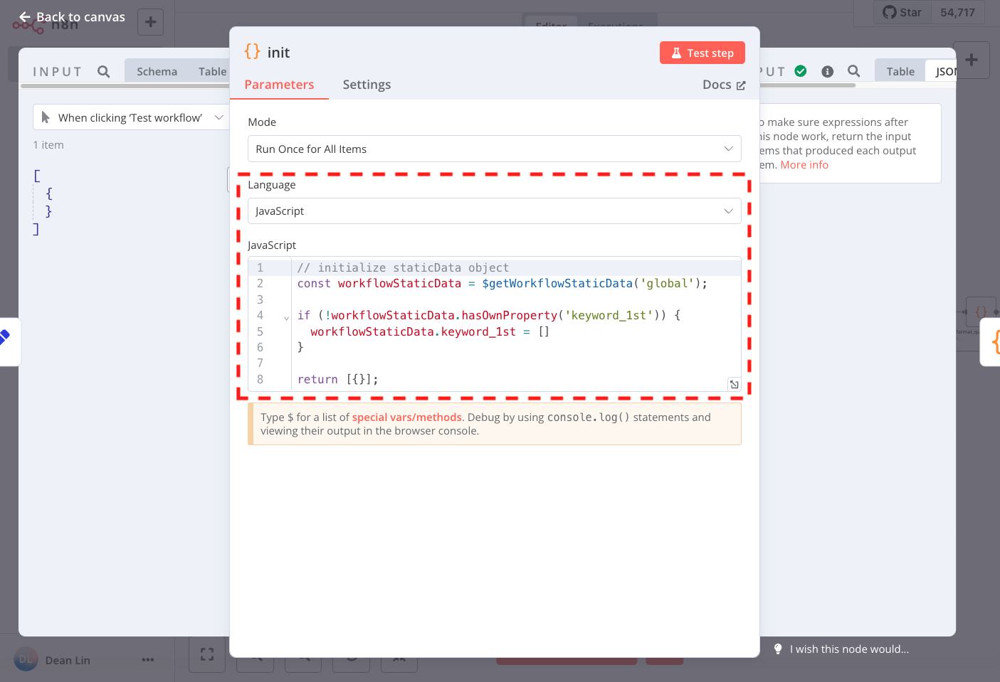

# [n8n 教學]掌握節點 (Node) 使用情境：Set、Loop Over Items、If、Code、HTTP Request、Wait

n8n 是一款功能強大的自動化工具，透過視覺化的操作介面，只需拖拉節點、設定參數，就能快速建立屬於你的工作流。

但如果你對 n8n 的基礎知識與節點功能不夠理解，可能會遇到各種常見的坑（ex: Loop Over Items 無法重置迴圈、讀不到過去節點的結果..）。

為了讓大家少踩坑，這篇文章將詳細介紹 n8n 節點的基礎操作，幫助你快速上手這款工具：

```
▋ Set Node: 設定 Workflow 共用的變數
▋ Loop Over Items Node: 執行重複任務
▋ HTTP Request: 呼叫 API
▋ Wait Node: 等待指定時間
▋ Code Node: 添加程式邏輯（ex: 格式化資料）
▋ 取得指定節點（Specific Node）的 Result
▋ 用 If Node 來 Reset Loop Over Items 資料
▋ 用 $getWorkflowStaticData 儲存資訊
```

> n8n 有[雲端](https://n8n.io/)與本地（local）的開源版本，基於資訊安全與使用限制，筆者強烈建立在本地（local）建立環境，[詳細的操作步驟可以參考這篇文章](https://dean-lin.medium.com/ab603faa300f)。

## ▋ Set Node: 設定 Workflow 共用的變數

Set Node 的主要功能是定義工作流中共用的變數，這樣當參數要調整時，只需要調整一個地方，不需要去多個地方調整，避免設定上的遺漏。

比如你想針對特定的 Google Sheet 做讀取、新增、修改的操作，就可以將 Google Sheet 的 URL 設定到 Set Node 的欄位中。

這樣後續要使用 Google Sheet URL 時，只要讀取這個 Set Node 的資訊即可，不需要在每個 Google Sheet 的節點重新設定。


> 小提醒: 在這邊設定的變數是「固定值」，如果想要設定可以更改的變數，請參考後面的「$getWorkflowStaticData」方案。

## ▋ Loop Over Items Node: 執行重複任務

Loop Over Items Node 可以針對獲得的每一筆資料（item）執行相同的操作。

像筆者在後續的範例中，因為要重複 Call Google 的 API 來取得關聯關鍵字，就會用到這個 Node:
- **loop**: 放上你要執行的重複任務。
- **done**: 重複任務執行完畢後，會得到的累計結果。


> 小提醒: Loop 迴圈是不會自動重置的，需要搭配 If Node 進行條件判斷，才能避免資料重複處理。

## ▋ HTTP Request Node: 呼叫 API

許多自動化流程都是需要呼叫 API 來取得權限（ex: token）的:
- **Method**: 有 GET/POST/DELETE 等方法可以選擇
- **URL**: 貼上 API URL
- **Authentication**: 執行 API 需要的憑證。
- **傳送參數**: 可以選擇用 Query Parameters 或 Send Body 的方式來傳送參數。

下面就用 Google 建議搜尋的 Get Method API 來向大家做個示範:


## ▋ Code Node: 添加程式邏輯（ex: 格式化資料）

當 n8n 預設的功能無法滿足需求時，就需要 Code Node 來處理了。

比如上面 HTTP Request Node 的結果是一個比較複雜的格式，我們可以透過程式將它轉換為自己期待的格式，並且可以透過 console.log 來協助 debug。


## ▋ Wait Node: 等待指定時間

Wait Node 可以在工作流間加入一段延遲。

比如我們在批量 Call API 時，為了避免伺服器過載，或是減少自己被黑名單的機率，可以設定 5 秒的間隔。


## ▋ 取得指定節點（Specific Node）的 Result

n8n 默認取得上一個節點（Previous Node）的 Result，但如果你想要取得更早之前 Node 的 Result，就要用到下面的方式：

- Node: 使用 Expression `{{ $('node_name').item.json.feild_name }}`


- Code: `$node["node_name"].json["feild_name"];`


## ▋ 用 If Node 來 Reset  Loop Over Items 資料

如果你有設計迴圈（Loop），可透過 If Node 設定條件來 Reset 資料，避免因未清空資料而導致流程錯誤。

如果你希望每次進入 Loop Over Items 時資料都清空，Workflow 可以參考下圖的結構來設計:
- 將 If Node 放在上一個 Node 的後面，Loop Over Items 前面。
- 將 Loop Over Items 的 done 連結到 If Node，這樣才能協助 Reset 資料。


If Node 我用 `{{ $runIndex }}` 跑第幾次來當作重置的判斷，如果次數小於上一步 items 的數量 `{{ $json.keys().length }}`，會走 True，進行重置。


為了讓重置的事件觸發，在 Loop Over Items Node，我們要在 Options 的 Reset 設定重置的邏輯為 `{{ $prevNode.name === 'if' }}`


## ▋ 用 $getWorkflowStaticData 儲存資訊

當需要跨節點（Node）保存資料時，可透過 $getWorkflowStaticData 儲存並讀取與更新工作流的靜態數據。

下面用 Code Node 展示初始化變數資訊的方式:

```js
const workflowStaticData = $getWorkflowStaticData('global');

if (!workflowStaticData.hasOwnProperty('keyword_1st')) {
  workflowStaticData.keyword_1st = []
}

return [{}];
```



如果你想要讀取、更新資料(範例是在 Array 裏面 push 資料)，可以這麼做:

```
const workflowStaticData = $getWorkflowStaticData('global');

workflowStaticData.keyword_1st.push('bbb')

console.log(workflowStaticData.keyword_1st)

return [{}];
```


以上就是今天的分享，如果你剛開始使用 n8n，不妨從這些節點開始入手。有任何問題歡迎留言討論！讓我們一起學習更有效率地使用 n8n。

如果你想看 n8n 精彩的案例，下一篇文章將會向大家分享呼叫 Google API 自動寫入 Google Sheet 來搜集關鍵字的實用範例！

> 延伸閱讀:
> - [[n8n 教學]在本地建立能串連不同服務的自動化工具](https://dean-lin.medium.com/ab603faa300f)
> - [[n8n 教學]在 Google Sheet 自動建立 SEO 關鍵字矩陣](https://dean-lin.medium.com/eeb1e6e2e2ba)