# [n8n 教學]在 Google Sheet 自動建立 SEO 關鍵字矩陣

最近上邱韜誠的 SEO 課程時，「如何找到大量關鍵字」的其中一個方法，就是用 Google Search 取得「相關搜尋字詞」，然後將它整理成一個關鍵字矩陣。

但如果要查大量的關鍵字，就會浪費很多時間在複製貼上的重複任務上。

剛好最近在研究 n8n，就把這個工作流整理成一個自動化流程。使用者只要填上自己的 Google Sheet URL，就能一鍵生成對應的 SEO 關鍵字矩陣了！

> n8n 有[雲端](https://n8n.io/)與本地（local）的開源版本，基於資訊安全與使用限制，筆者強烈建立在本地（local）建立環境，[詳細的操作步驟可以參考這篇文章](https://dean-lin.medium.com/ab603faa300f)。

## ▋ 自動建立 SEO 關鍵字矩陣工作流（Workflow）簡介

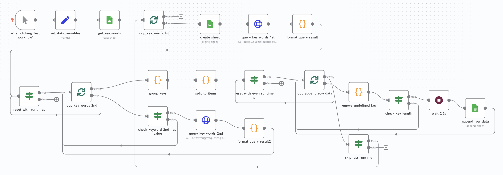

上圖是完整的工作流（Workflow），下面說明一下執行步驟 & 設計邏輯:
**STEP 1**: 填寫要讀取的 Google Sheet URL 與工作表名稱（set_google_sheet_info）。

**STEP 2**: 讀取 Google Sheet 裡面的要查詢的關鍵字（get_keywords）。

**STEP 3**: 第一層迴圈（loop_keywords_1st）會根據關鍵字來建立 Sheet（create_sheet）與查詢關鍵字（query_keywords_1st），並將資料格式化為可以使用的型態（format_query_result）給下一步驟。

**STEP 4**: 第二層迴圈（loop_keywords_2nd）會根據上一層給予的關聯關鍵字，再做第二次的搜尋（query_keywords_2nd），同樣也要將資料格式化爲可以使用的型態（format_query_result2）。

**STEP 5**: 得到 SEO 關鍵字後，要先把他們分成指定的群組（group_keys），並分割成適合寫入 Google Sheet 的格式（split_to_items）。

**STEP 6**: 最後透過迴圈（loop_append_row_data）過濾掉無法寫入的值（remove_undefined_key），先等待 2.5 秒（wait_2.5s），再逐行寫入 Google Sheet（append_row_data），避免太頻繁呼叫 API。

備註1: reset_with_runtimes、reset_with_even_runtimes 這兩個節點（Node），是為了在 Done 的情境下 Reset Loop Over Items 重複執行時累計的資料。

備註2: check_keyword_2nd_has_value、check_key_length 是為了處理空陣列的情境。

## ▋ 如何使用這個 n8n 的工作流（Workflow）

如果你只是想要使用這個 Workflow，可以直接複製筆者放在 [GitHub 上的範本](./workflow/google_sheet_keyword.json)，貼到 n8n 的 Workflow（不要懷疑，貼上就對了），並根據下面的步驟完成設定就可以執行了。

**STEP 1**: 建立一個 Google Sheet，在「工作表1」的第一欄填寫關鍵字（keyword），範例如下

**STEP 2**: 打開 n8n「set_google_sheet_info」的 Node，在「google_sheet_url」欄位上貼上自己的 Google Sheet URL

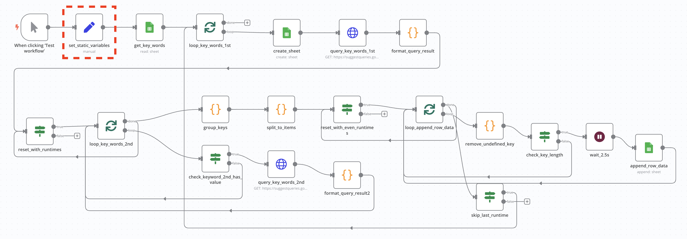

**STEP 3**: 打開「get_keywords、create_sheet、append_row_data」的 Node，選擇 Google Sheets account 的 Credential（如果過去沒有建立過，可以參考後面文章的教學）。

完成上面的步驟後，點擊「Test workflow」就可以自動生成 Google SEO 關鍵字矩陣啦！從下圖可以看到

## ▋ 建立 Google Sheets API 的 Credential

**STEP 1**: 打開任一 Google Sheet Node，點擊「Create New Credential」。

**STEP 2**: 建立一個 [Google Cloud](https://cloud.google.com/) 帳號，有 Gmail 就能直接使用，下面是登入後的畫面。

**STEP 3**: 進入「[控制台](https://console.cloud.google.com/)（Google Cloud Console）」，選擇「New Project」並在 Project name 輸入「n8n test」。

**STEP 4**: 建立完成後會出現下面的頁面，因為我們要開啟 Google Sheet 的權限，所以點擊「API & Services」。

**STEP 5**: 然後點擊「+ ENABLE APIS AND SERVICES」。

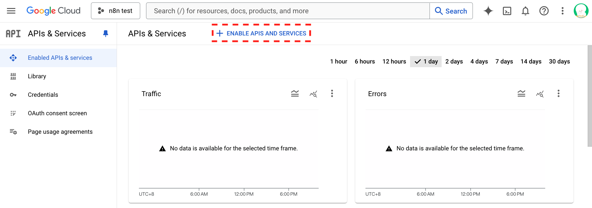

**STEP 6**: 在搜尋框輸入「google sheet api」。

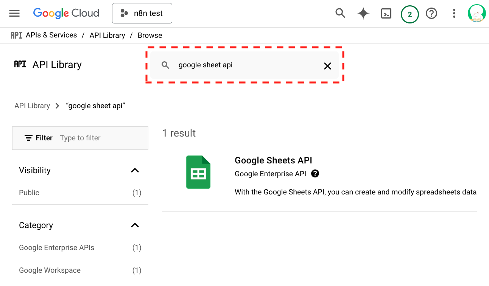

**STEP 7**: 點擊「ENABLE」來開啟權限。

**STEP 8**: 開啟好權限後，點擊左側的「OAuth consent screen」建立 APP。

**STEP 9**: 資訊填寫完成後，要點擊「PUBLISH APP」才能使用（你也可以加入 User，用內測的方式使用）。

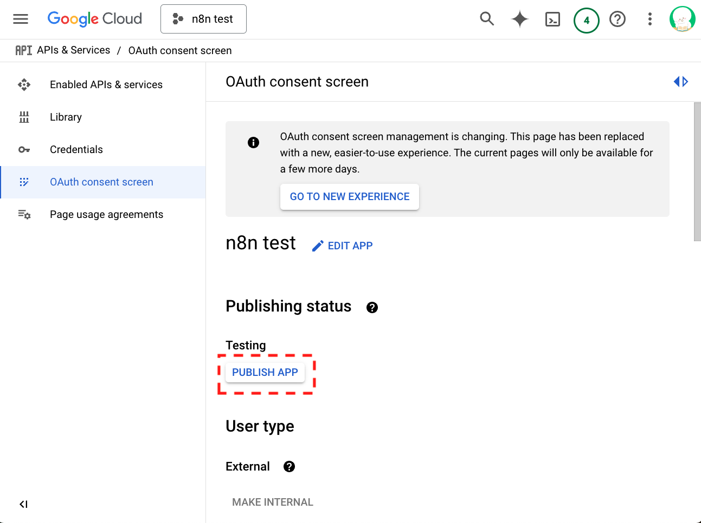

**STEP 10**: 點擊上方的「+ CREATE CREDENTAILS」，選擇「OAuth Client ID」。

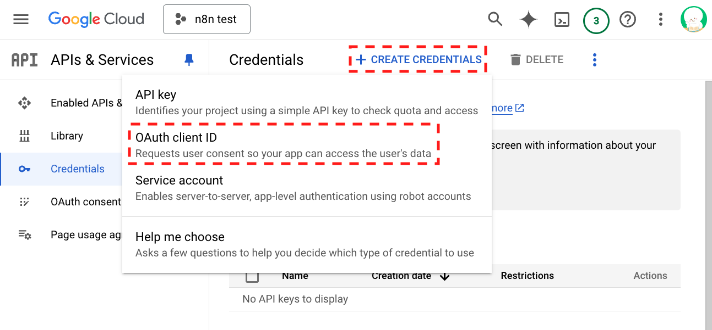

**STEP 11**: Application type 選擇「Web application」，Name 自行決定。

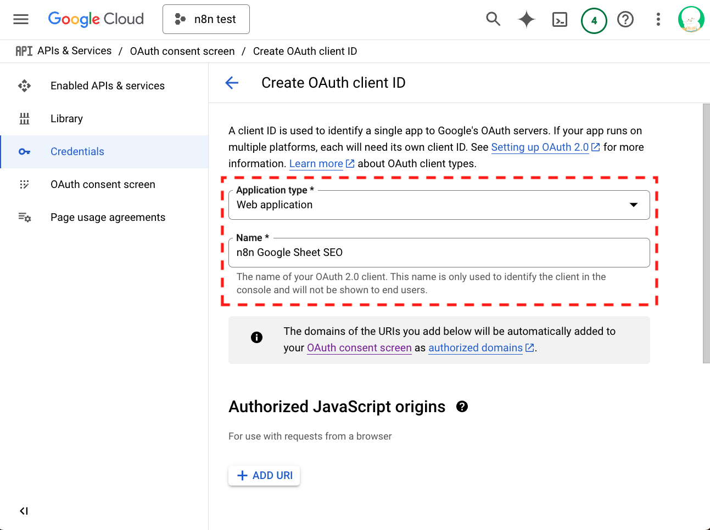

**STEP 12**: 在「Authorized redirect URIs」填入 n8n 的網址，如果你是在 local 操作就填寫 `http://localhost:5678/rest/oauth2-credential/callback`

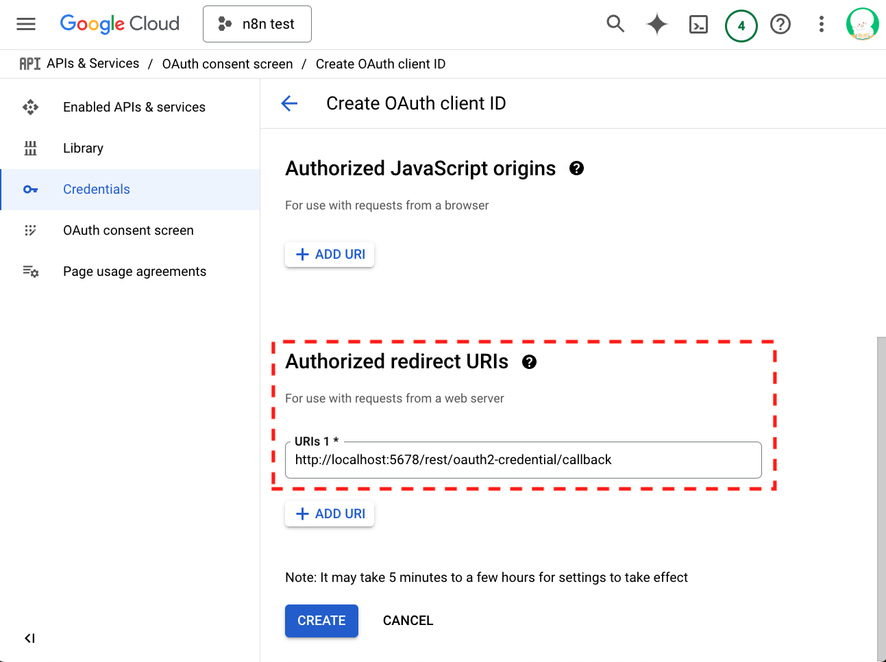

**STEP 13**: 按下 Create 後就會取得最關鍵的「Client ID、Client secret」，把他們複製下來。

**STEP 14**: 畫面切回到 n8n 的 Google Sheet Node，填上「Client ID、Client secret」。

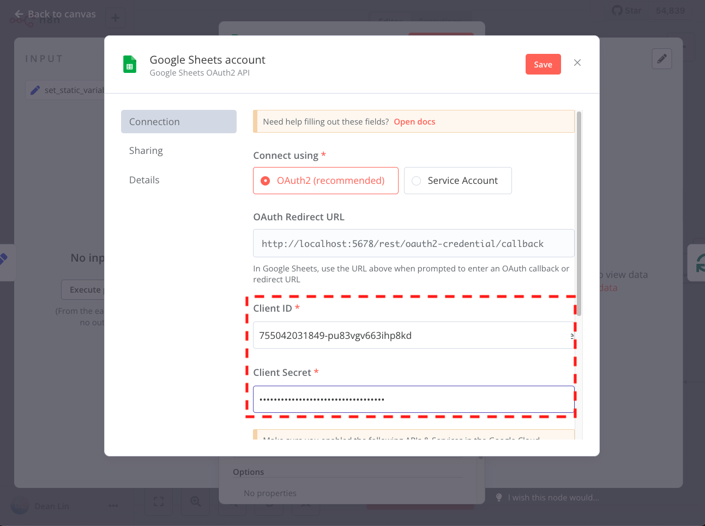

**STEP 15**: 點擊「Sign in with Google」後，勇敢的點擊「繼續」與「前往」。

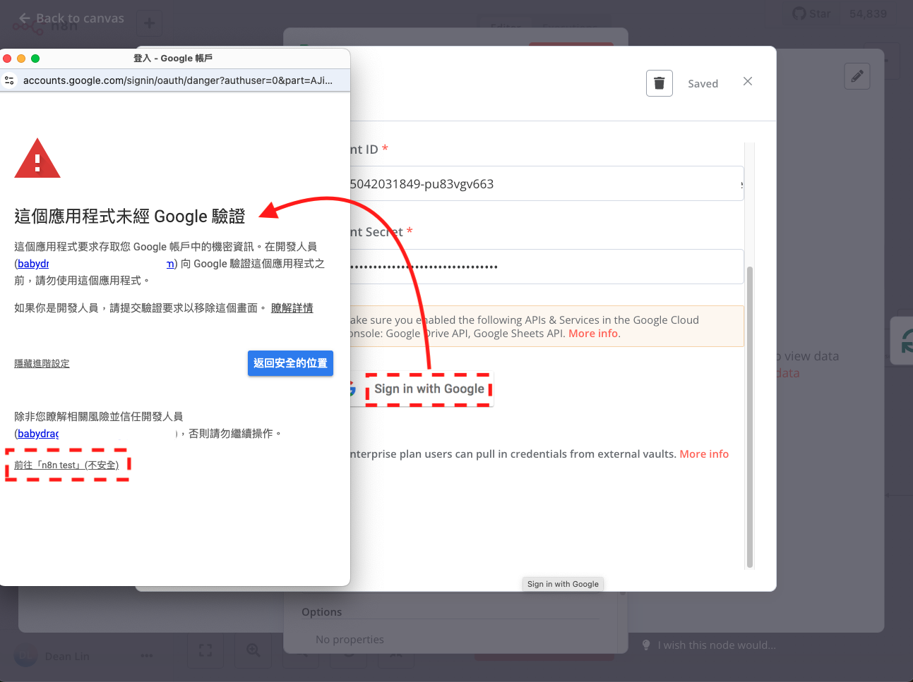

**STEP 16**: 選擇允許 n8n 可以使用的範圍（這邊看個人需求，勾全選比較不會遇到權限的問題）。

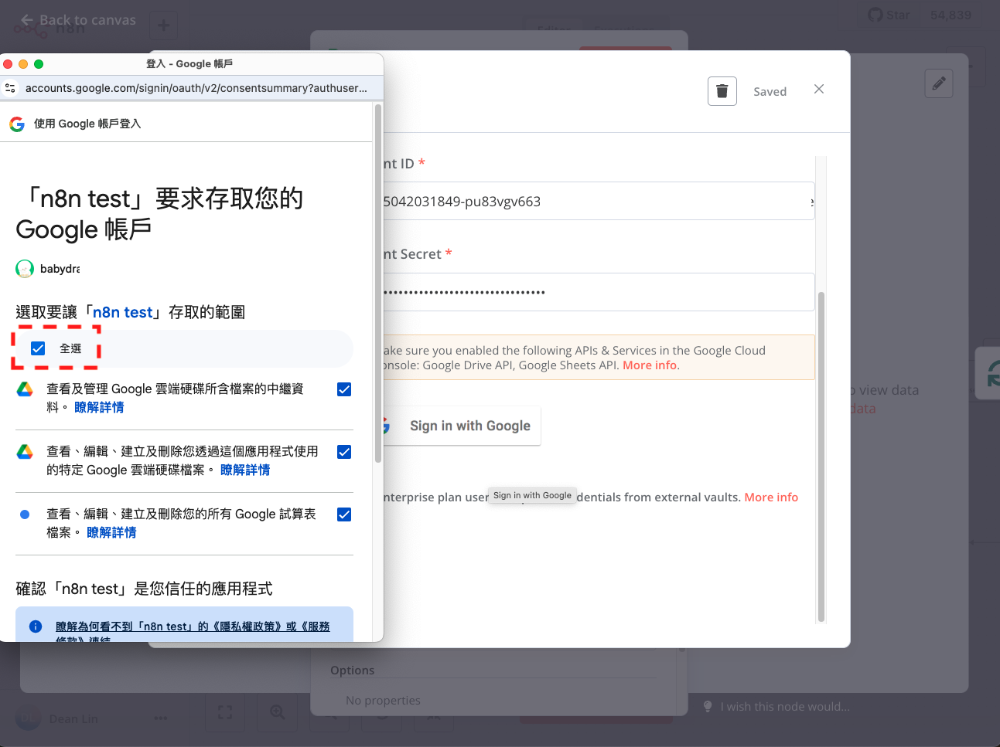

**STEP 17**: 看到畫面出現「Got Connected」就代表你大功告成啦！！！

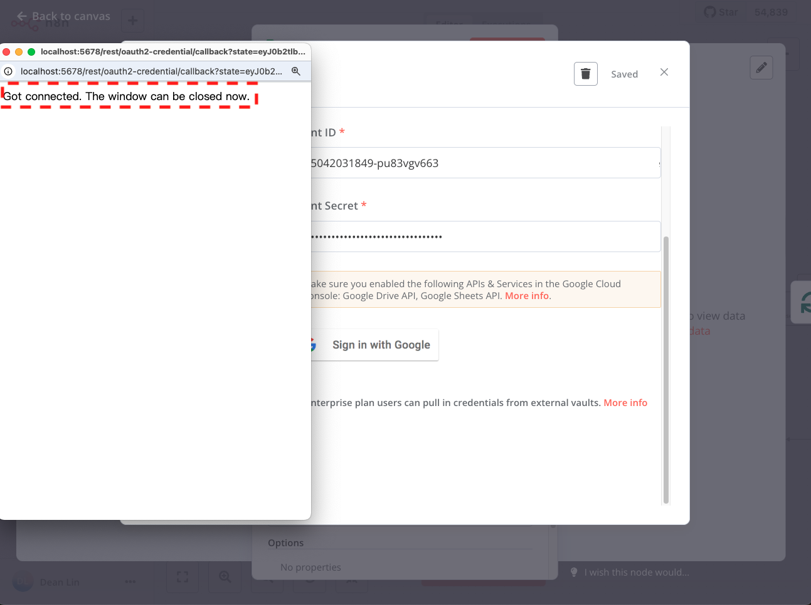

如果看完這篇文章，代表你是一個充滿意志力的人，給自己拍拍手的同時，也可以幫筆者的文章拍拍手喔（這系列真的寫到快崩潰 QQ）。

> 延伸閱讀:
> - [[n8n 教學]在本地建立能串連不同服務的自動化工具](https://dean-lin.medium.com/ab603faa300f)
> - [掌握節點 (Node) 使用情境：Set、Loop Over items、If、Code、HTTP Request、Wait](https://dean-lin.medium.com/e8c804619b57)